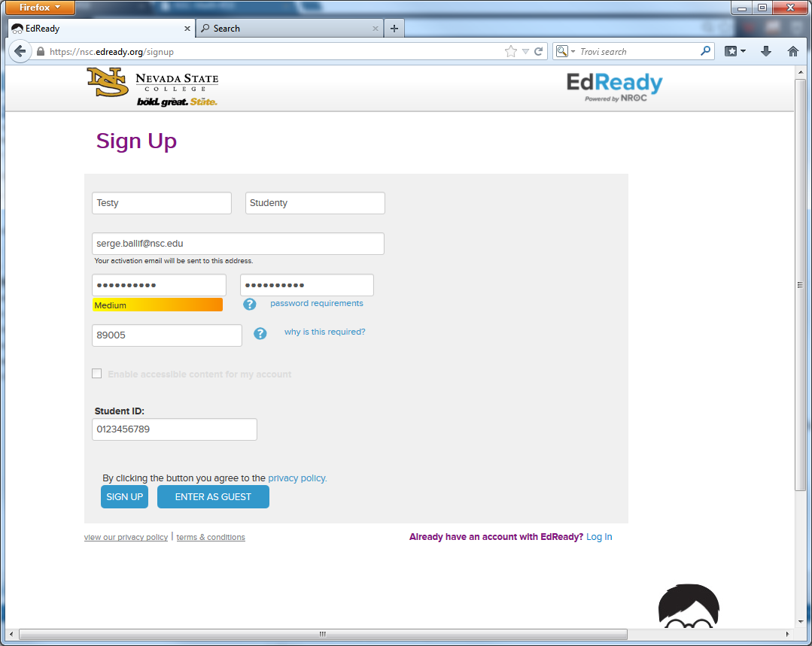

<section>
        

          <h1>NSC-EdReady</h1>
          
a resource for students who want to get through colleg math quickly

          

        

        
        
<h2>What is EdReady?</h2>

EdReady is a free learning platform that motived students can use to fill in the gaps in their math knowledge. EdReady contains videos and learning materials to help you learn the content that you would normally by taking Math 95M at NSC.

The EdReady promotional video explains how it works.

Students who would like to improve their placement from the Acuplacer test can work through Edready to place into a higher class.

<h2>How do I get started?</h2>

Go to <a href="https://nsc.edready.org/home">NSC EdReady</a> and click “Get Started”. Sign up using your NSHE ID. (Be sure to use your real name and NSHE ID.)

Click on the link for <strong>Accuplacer Prep-Elementary Algebra</strong>.

Add <strong>Accuplacer Prep-Elementary Algebra</strong> to your goals by clicking on the button.

Each time you log in you will work on this goal. Now you are at a window that lets you view your progress. Click on <strong>Start assessment</strong> to take your initial test to see what you need to work on.

Over time you can view your progress as your score rises.
        
        
</section>

## What is EdReady?

EdReady is a free learning platform that motived students can use to fill in the gaps in their math knowledge. EdReady contains videos and learning materials to help you learn the content that you would normally by taking Math 95M at NSC. 

The EdReady promotional video explains how it works.

Students who would like to improve their placement from the Acuplacer test can work through Edready to place into a higher class.

## How do I get started?

Go to [NSC EdReady](https://nsc.edready.org/home) and click "Get Started". Sign up using your NSHE ID. (Be sure to use your real name and NSHE ID.)

Click on the link for __Accuplacer Prep-Elementary Algebra__.

Add __Accuplacer Prep-Elementary Algebra__ to your goals by clicking on the button. 

Each time you log in you will work on this goal. Now you are at a window that lets you view your progress. Click on __Start assessment__ to take your initial test to see what you need to work on. 

Over time you can view your progress as your score rises.

