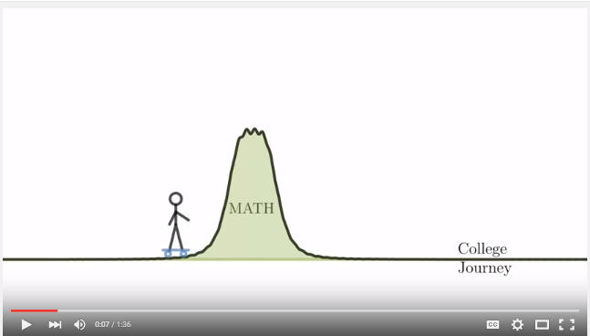
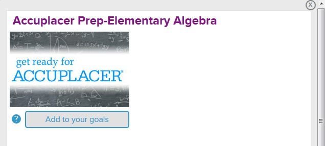
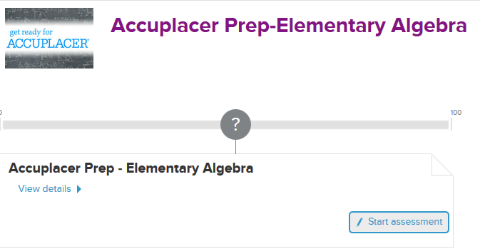

<section>
        

          <h1>NSC-EdReady</h1>
          
a resource for students who want to get through college math quickly

          

        

</section>

## What is EdReady?

EdReady is a free learning platform that motivated students can use to fill in the gaps in their math knowledge. EdReady contains videos and learning materials to help you learn the content that you would normally learn by taking Math 95M at NSC. 

The official EdReady promotional video gives an overview of how it works.

Students who would like to improve their placement from the Accuplacer test can work through EdReady to place into a higher class. (In the long run we would like to phase out the Accuplacer test altogether and replace it with EdReady.)

## How do I get started?

Go to [NSC EdReady](https://nsc.edready.org/home) and click __Get Started__. Sign up using your NSHE ID. (Be sure to use your real name and NSHE ID.)

Once you are signed up and logged in click on the link for __Accuplacer Prep-Elementary Algebra__.

Add __Accuplacer Prep-Elementary Algebra__ to your goals by clicking on the button. 

Each time you log in you will work on this goal. Now you are at a window that lets you view your progress. Click on __Start assessment__ to take your initial test to see what you need to work on. 

Over time you can view your progress as your score rises.

## How will my EdReady score affect my placement?

You must first take the Accuplacer test to get an initial placement. Then you can work through EdReady to improve your placement. Everything must be completed manually at this time, so you will need to contact LaKaisha Hollingsworth at LaKaisha.Hollingsworth@nsc.edu so that she can verify your progress and place you in a class. __Note that we will only place students in a course if they have completed the Accuplacer test.__ This policy may change in the future, but for now we need data.

<table>
<thead>
<tr>
<th>EdReady Score</th>
<th>Class Placement</th>
</tr>
</thead>
<tbody>
<tr>
<td>$0$–$89$</td>
<td>Math 95M</td>
</tr>
<tr>
<td>$90$–$99$</td>
<td>Math 120E</td>
</tr>
<tr>
<td>$100$</td>
<td>Math 120</td>
</tr>
</tbody>
</table>

## What if I have questions?

For questions about EdReady you can read the FAQ on EdReady. (The link to the FAQ can be found in the student dashboard down below the face.)

For questions about the mathematical content you can use the Piazza discussion board. To sign up for the discussion board, go to [piazza.com/nsc.nevada/other/foundationalmath](piazza.com/nsc.nevada/other/foundationalmath) and sign up. You can access the discussion board at [piazza.com/nsc.nevada/other/foundationalmath/home](piazza.com/nsc.nevada/other/foundationalmath/home). Be sure to ask meaningful questions that spell out what is being asked and how you approached the solution. Don't just refer to a question type or number because the problems are generated algorithmically, so no two students get the same questions.

